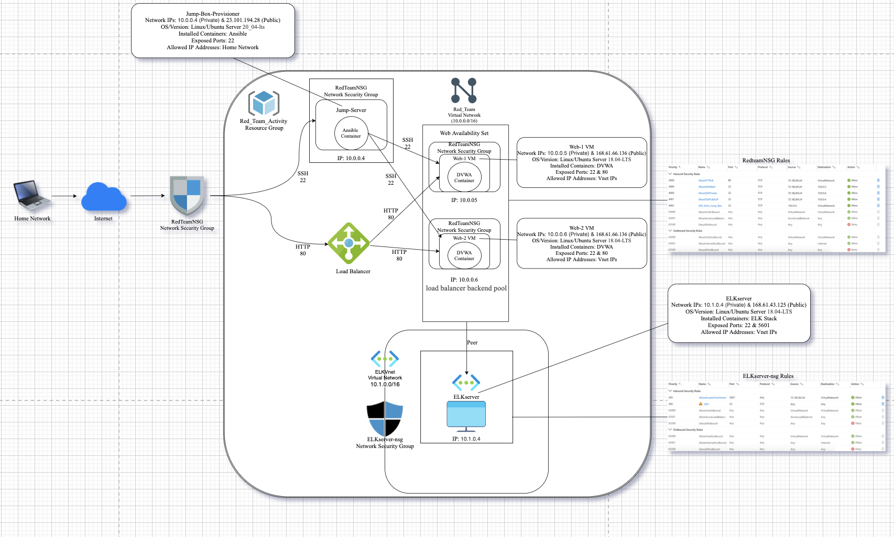
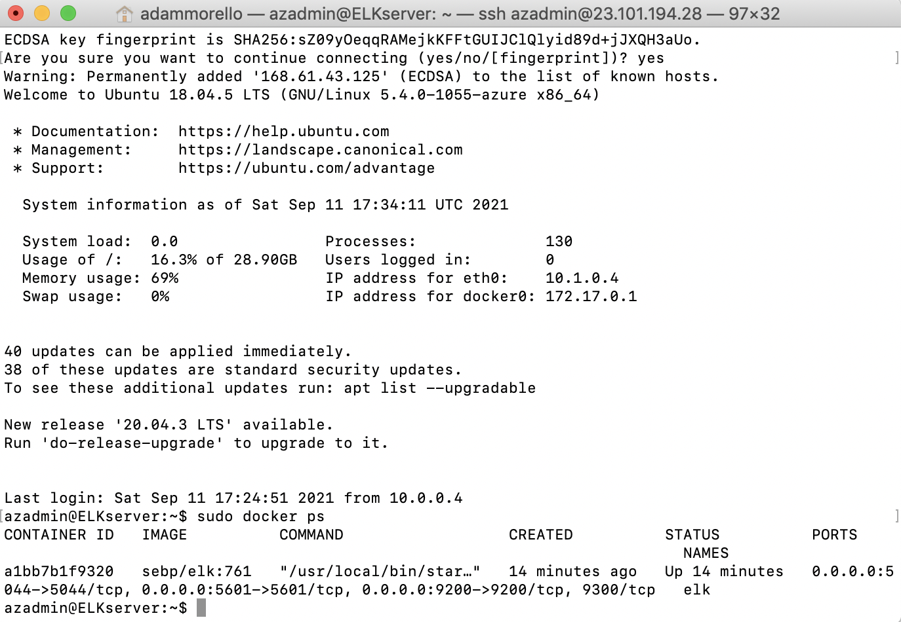

## Automated ELK Stack Deployment

The files in this repository were used to configure the network depicted below.

These files have been tested and used to generate a live ELK deployment on Azure. They can be used to either recreate the entire deployment pictured above. Alternatively, select portions of the filebeat-playbook.yml file may be used to install only certain pieces of it, such as Filebeat.

  - _install-elk.yml_

This document contains the following details:
- Description of the Topology
- Access Policies
- ELK Configuration
  - Beats in Use
  - Machines Being Monitored
- How to Use the Ansible Build

### Description of the Topology

The main purpose of this network is to expose a load-balanced and monitored instance of DVWA, the D*mn Vulnerable Web Application.

Load balancing ensures that the application will be highly available and reliable, in addition to the jump-box restricting access to the network, Load balencers are effectively protecting against distributed denial-of-service (DDoS) attacks through the distribution of treaffic accross all servers within the network.
- _TODO: What aspect of security do load balancers protect? What is the advantage of a jump box?_

Integrating an ELK server allows users to easily monitor the vulnerable VMs for changes to the log files in Web-1 and Web-2 using the filebeat software and system metrics and statistics using metricbeat software.
- _TODO: What does Filebeat watch for?_
- _TODO: What does Metricbeat record?_

The configuration details of each machine may be found below.
_Note: Use the [Markdown Table Generator](http://www.tablesgenerator.com/markdown_tables) to add/remove values from the table_.

| Name     | Function | IP Address | Operating System |
|----------|----------|------------|------------------|
| Jump Box | Jump-Box-Provisioner | 10.0.0.4   | Linux            |
| Web-1    | webserver| 10.0.0.5   | Linux            |
| Web-2    | webserver| 10.0.0.6   | Linux            |
| ELKserver| webserver| 10.1.0.4   | Linux            |

### Access Policies

The machines on the internal network are not exposed to the public Internet. 

Only the Jump-Box-Provisioner machine can accept connections from the Internet. Access to this machine is only allowed from the following IP addresses:
- _Home Network_

Machines within the network can only be accessed by Jump-Box-Provisioner.
- _Jump-Box-Provisioner 10.0.0.4_

A summary of the access policies in place can be found in the table below.

| Name     | Publicly Accessible | Allowed IP Addresses |
|----------|---------------------|----------------------|
| Jump-Box-Provisioner | Yes/No              | 23.101.194.28/10.0.0.4  |
| Web-1    | Yes/No              | 10.0.0.5/168.61.66.136  |
| Web-2    | Yes/No              | 10.0.0.6/168.61.66.136  |
| ELKserver| Yes/No              | 10.1.0.4/168.61.43.125  |

### Elk Configuration

Ansible was used to automate configuration of the ELK machine. No configuration was performed manually, which is advantageous because...
- _It allows you to configure multiple machines._

The playbook implements the following tasks:

- Install docker.io
- Install python3-pip
- Install Docker module
- download and launch a docker elk container

The following screenshot displays the result of running `docker ps` after successfully configuring the ELK instance.

### Target Machines & Beats
This ELK server is configured to monitor the following machines: 

- Web-1 (10.0.0.5) & Web-2 (10.0.0.6)

We have installed the following Beats on these machines:

- Filebeat & Metricbeat.

These Beats allow us to collect the following information from each machine:

- Filebeat monitors the log files or locations that you specify, collects log events, and forwards them either to Elasticsearch or Logstash for indexing, while metricbeat helps you monitor your servers by collecting metrics from the system and services running on the server. An example of filebeat would be anytime a log file changes and an example of metricbeat would be CPU.

### Using the Playbook
In order to use the playbook, you will need to have an Ansible control node already configured. Assuming you have such a control node provisioned: 

SSH into the control node and follow the steps below:
- Copy the install-elk.yml file to /etc/ansible/install-elk.yml.
- Update the /etc/ansible/hosts file to include...
- Run the playbook, and navigate to http://168.61.43.125:5601/app/kibana#/home to check that the installation worked as expected.

_TODO: Answer the following questions to fill in the blanks:_
- _Which file is the playbook? Where do you copy it?_
- install-elk.yml copy to /etc/ansible/install-elk.yml
- _Which file do you update to make Ansible run the playbook on a specific machine? How do I specify which machine to install the ELK server on versus which to install Filebeat on?_
- /etc/ansible/hosts & you could specify the group with brackets.
- _Which URL do you navigate to in order to check that the ELK server is running?
- 168.61.43.125:5601

_Use these commands to download the playbook, run the playbook, update the files, upgrade the files_
- Command to download playbook:
- `ansible-playbook playbook.yml`
- Command to run the playbook:
- `ansible-playbook install-elk.yml`
- Command to update the files:
- `sudo apt-get update -y`
- Command to upgrade:
- `sudo apt-get update -y`